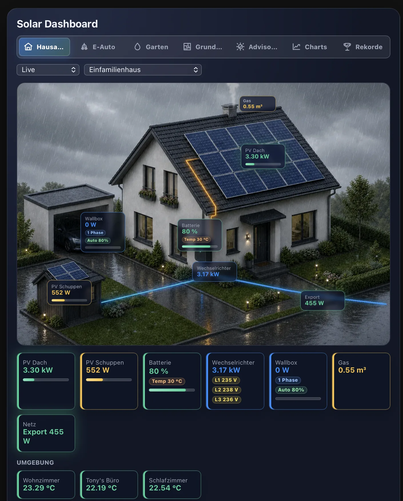
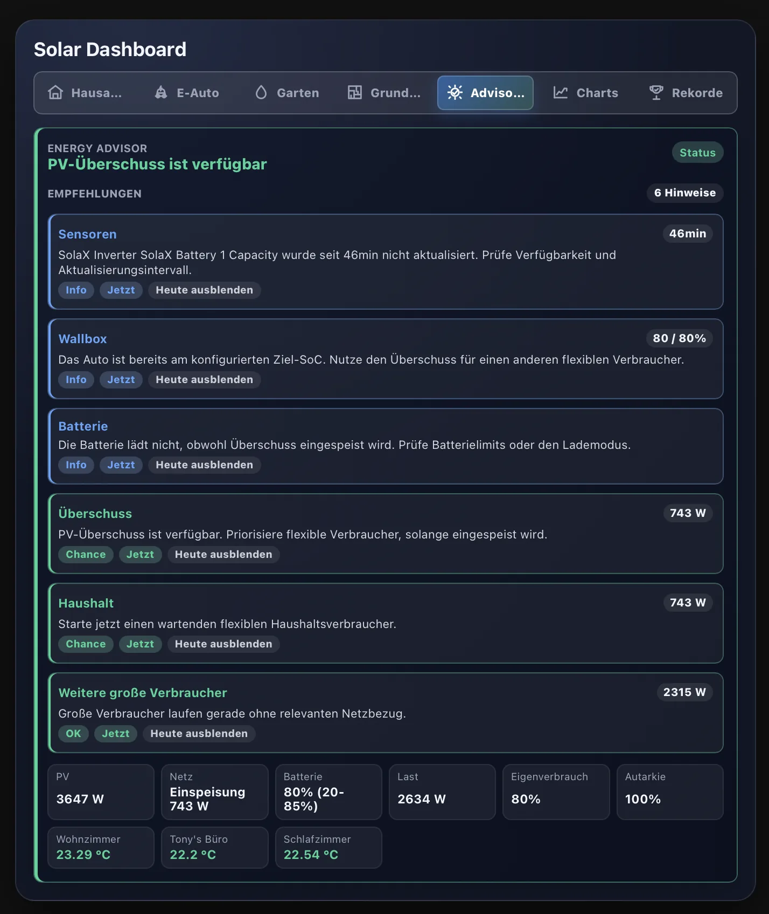
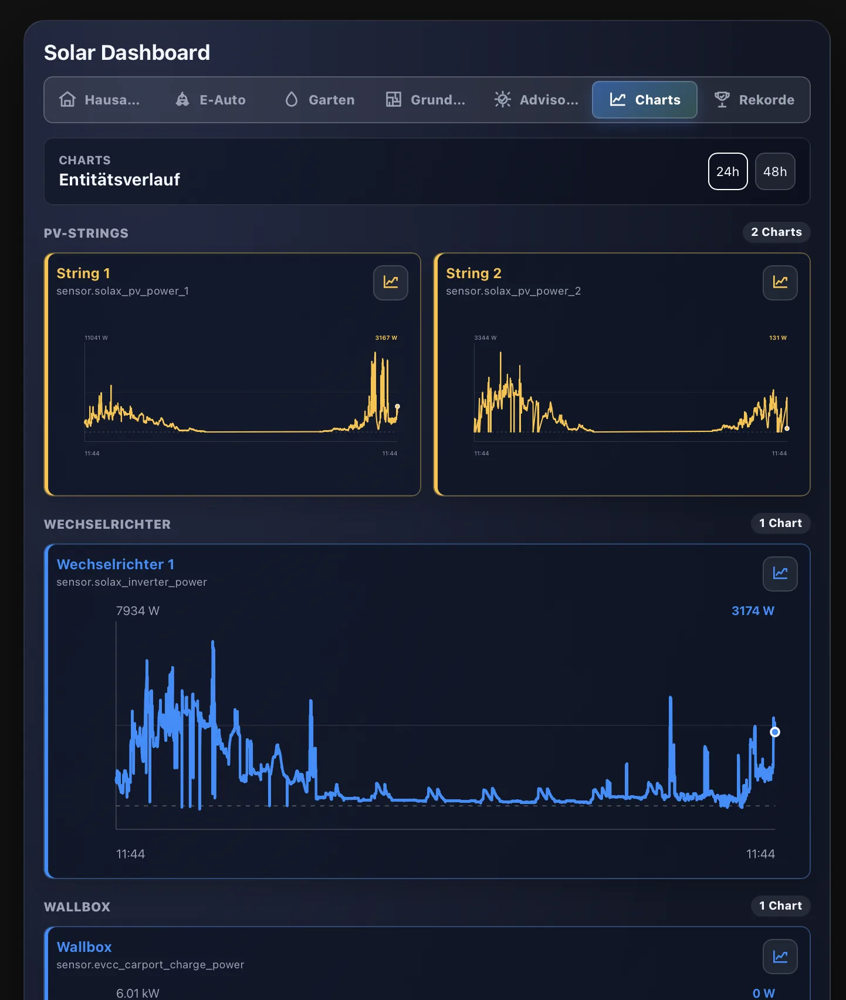
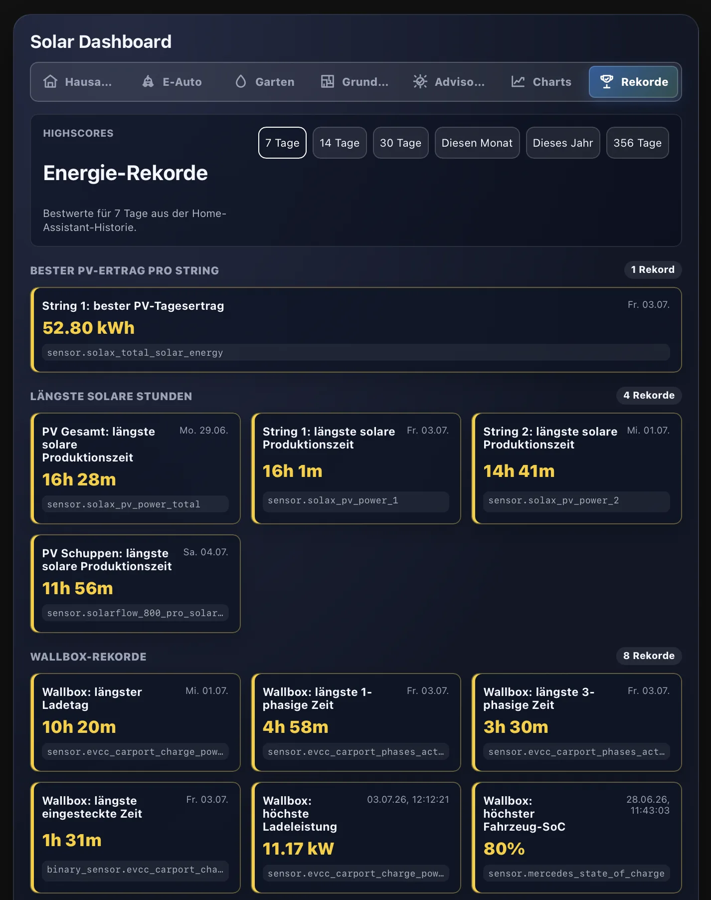

# HA Solar Dashboard Card

[](https://github.com/404GamerNotFound/ha-solar-dashboard/stargazers)
[](https://github.com/sponsors/404GamerNotFound)
[](https://www.paypal.com/paypalme/TonyBrueser)
[](https://revolut.me/tony1995)

[](https://github.com/hacs/default)

A custom Home Assistant Lovelace card for HACS that renders a modern PV/energy overview with an image-based layout.

## Screenshots



<table>
  <tr>
    <td></td>
    <td></td>
    <td></td>
  </tr>
  <tr>
    <td align="center">Advisor</td>
    <td align="center">Charts</td>
    <td align="center">Records</td>
  </tr>
</table>

## Highlights

- Image-based Home Assistant Lovelace card for PV, battery, inverter, grid, EV charging, garden, records, charts, and energy advice.
- Responsive tab navigation for House, E-Auto, Garden, Floorplan, Advisor, Charts, and Records views.
- Built-in editor with setup wizard, entity suggestions, page-scoped setup helpers, layout controls, and regional presets.
- EU and US friendly defaults via `region_profile` and `unit_system`, including `$` prefix, `gal`, `°F`, `in`, `psi`, `gal/min`, and `mi`.
- Localized card and editor labels for `en`, `de`, `es`, `fr`, and `pl`.

## Features

### House Dashboard

- Selectable house layouts from the `images` folder: `single_family_home`, `single_family_home_landscape`, `duplex_house`, `terraced_middle_house`, `apartment_building`, `apartment_building_balcony_solar`, `bungalow`, `city_villa`, and `city_villa_pitched_roof`. The landscape single-family home provides more horizontal space for HUD boxes and moves the solar shed to the right.
- Automatic day/night image switching via `sun.sun`, plus optional weather-specific image suffixes from `weather_entity`.
- Custom standard/night and daylight images via `/local/...` or full `https://...` image URLs.
- Image HUD boxes and footer tiles for roof PV, shed PV, PV total, house consumption, battery, inverter, EV chargers, water meter, grid import/export, and additional consumers.
- Free X/Y positioning for all image HUD boxes, image overlays, EV badges, garden badges, and floorplan elements.
- Optional animated power flow overlay between configured image elements.
- Dynamic tile colors and glow states with configurable threshold rules.
- Utilization bars for PV, inverter, and EV charger values based on configured `max_power_kw` values.
- Hover tooltips with linked entity, raw state, formatted value, and update time.
- Clickable entity boxes and tiles open a 24/48 hour Home Assistant history chart.

### Energy, Grid, And Finance

- Signed or split grid sensors for import/export power.
- Grid status tile for import, export, or self-sufficient operation.
- Configurable neutral threshold for near-zero grid flow.
- Optional daily import cost and export revenue labels from cumulative kWh counters.
- Currency symbol/code support with `currency_position: auto | prefix | suffix`; common symbols like `$` are placed before the amount in `auto`.
- Configurable high-voltage and critical-voltage alert thresholds for grid voltage sensors.
- Time range selector for `Live`, `1h`, `24h`, `1 month`, `1 year`, and `Total` values when cumulative counters are configured.

### Regional Units

- `region_profile: eu | us | auto` applies region defaults without overwriting explicit single-option overrides.
- `unit_system: metric | us | auto` controls regional target units.
- US profile defaults include `$`, `gal`, `°F`, `in`, `psi`, `gal/min`, and `mi`.
- Metric profile defaults include `€`, `m³`, `°C`, `mm`, `bar`, `L/min`, and `km`.
- Water meter and garden water values convert between `m³`, `L`, and US gallons.
- Garden temperature, rain, pressure, and water flow values convert to the configured target units.
- EV vehicle range can be shown as `km` or `mi`.
- Voltage thresholds remain manually configurable because US installations may expose 120 V, 240 V, or split-phase values.

### Battery And EV Charging

- Battery SoC fill meter in both image HUD and footer tile.
- Signed or split battery charge/discharge flow entities.
- Battery min/max SoC entities for reserve and target-limit-aware Advisor recommendations.
- Battery temperature badge and battery cycle diagnostics.
- Optional first and second EV charger entities, including power, phase, vehicle SoC, target SoC, connected state, charging-enabled state, and remaining charge time.
- EVCC/marq24 loadpoint support through `electric_vehicle.evcc_loadpoint` and `electric_vehicle.evcc_prefix`.
- EVCC charge mode control for Off, PV, Min+PV, and Fast when `electric_vehicle.entities.mode_control` is configured.
- EVCC badges and tiles can be shown or hidden independently per value for mobile, desktop, both, or neither.
- EV-specific day/night images and freely positioned vehicle image badges.

### Advisor Dashboard

- Dedicated Advisor view with live PV, grid, load, battery, autarky, self-consumption, and custom KPI context.
- Prioritized recommendations for PV surplus, grid import, battery state, EV charging, heat pump use, flexible appliances, and unusual PV/load situations.
- Sensor diagnostics for stale values, unavailable sensors, battery temperature limits, low SoC, frequent cycles, and simultaneous split import/export readings.
- Advisor actions can be marked as "now" or hidden for the day from the UI.
- Maximum number of suggestions and stale-sensor thresholds are configurable.

### Charts And Records

- Charts dashboard groups Home Assistant history by PV strings, inverters, wallboxes, grid, battery, consumers, and system values.
- 24/48 hour chart range selection for quick inspection.
- Records dashboard calculates best values over `7d`, `14d`, `30d`, current month, current year, or `356d`.
- Records cover PV daily yield, solar production duration, wallbox charging duration and peaks, grid finance, large consumers, counters, and more when the required entities are configured.

### Garden And Floorplan

- Garden dashboard with mower status, irrigation state, zones, manual actions, weather, soil, water flow, water pressure, cistern, lights, outlets, pumps, and pools.
- Irrigation zones support image markers, zone tiles, plan text/entity, color, visibility, and safe More Info behavior by default.
- Manual garden actions can use script, button, or switch entities with optional confirmation text.
- Garden day/night images and separately positioned garden badges.
- Floorplan dashboard with multiple levels, rooms, walls, sensors, reusable environment sensors, optional image-backed floorplans, and per-element layout controls.

### Extensibility

- Custom KPI tiles with entity or static values, units, color, sort position, and desktop column width.
- Environment sensor tiles for temperature, hot water, outdoor values, pressure, humidity, air quality, CO2, PM2.5, AQI, and custom sensors.
- Additional large consumer tiles for washing machine, dishwasher, fan heater, dryer, domestic hot water heat pump, and custom devices.
- Multiple PV roof strings and additional inverters with sum, values, dominant, or detailed per-inverter display modes.
- Optional smoke/gas and heat pump image overlays with labels, entities, period selection, position, size, and orientation controls.

## Installation (HACS)

1. Add this repository as a **Custom repository** in HACS with type **Dashboard**. HACS calls Lovelace cards "Dashboard" in the UI.
2. Install **HA Solar Dashboard Card**.
3. Restart Home Assistant (or reload resources).
4. Add the card in Lovelace.

## Lovelace resource (if needed)

```yaml
url: /hacsfiles/ha-solar-dashboard/ha-solar-dashboard.js
type: module
```

## Setup wizard

When the card is edited in Home Assistant, the editor includes a setup wizard that scans available entities and suggests matching sensors. It can fill only empty fields or replace detected fields on request.

The wizard uses entity ids, friendly names, units, `device_class`, and `state_class` to suggest common sensors such as PV power, battery SoC and flow, inverter power, wallbox power and badges, grid import/export, house consumption, weather, and cumulative kWh counters. Review the suggestions before applying them, especially when your system has multiple inverters, batteries, EV chargers, or split import/export sensors.

The global wizard remains available on the Setup tab. The Energy, Devices, E-Auto, Garden, and Advisor tabs also show a page-scoped wizard that only applies suggestions for the entities on that editor page.

## Regional presets

Use `region_profile` when you want a quick regional default set, and use `unit_system` when you only want to control units. Explicit single options always win over the preset.

```yaml
# European/metric defaults
region_profile: eu
unit_system: auto
```

```yaml
# United States defaults
region_profile: us
unit_system: auto
```

With the US profile, the card uses `$` before money values and defaults regional display units to gallons, Fahrenheit, inches, PSI, gallons per minute, and miles where the card has a domain-specific formatter. You can still override any single unit:

```yaml
region_profile: us
units:
  water_meter: gal
  temperature: °F
  precipitation: in
  pressure: psi
  flow: gal/min
  distance: mi
```

Voltage warning thresholds are intentionally not part of the regional preset. US systems can report 120 V, 240 V, or split-phase values, so configure `grid_voltage_warning_threshold` and `grid_voltage_critical_threshold` explicitly for your installation.

## Example configuration

```yaml
type: custom:ha-solar-dashboard-card
title: Solar Dashboard
house: single_family_home
region_profile: eu
unit_system: metric
view_mode: house
show_view_selector: true
show_house_selector: true
show_environment_sensors: true
show_electric_vehicle: true
show_garden: true
entities:
  pv_roof_power: sensor.pv_dach_leistung
  pv_shed_power: sensor.pv_schuppen_leistung
  battery_level: sensor.batterie_soc
  # Option A: one signed entity; positive = charging, negative = discharging
  battery_flow_power: sensor.batterie_leistung
  # Option B: separate entities; used when the signed entity is empty
  battery_charge_power: sensor.batterie_ladeleistung
  battery_discharge_power: sensor.batterie_entladeleistung
  battery_min_soc: number.batterie_min_soc
  battery_max_soc: number.batterie_max_soc
  battery_temperature: sensor.batterie_temperatur
  battery_cycles_today: sensor.batterie_zyklen_heute
  inverter_power: sensor.wechselrichter_leistung
  wallbox_power: sensor.wallbox_leistung
  wallbox_phase: sensor.wallbox_phasen
  wallbox_soc: sensor.wallbox_auto_soc
  wallbox_max_soc: number.wallbox_ziel_soc
  wallbox_connected: binary_sensor.wallbox_auto_verbunden
  wallbox_charging_enabled: switch.wallbox_laden_aktiviert
  wallbox_remaining_time: sensor.wallbox_verbleibende_ladezeit
  wallbox2_power: sensor.wallbox_2_leistung
  wallbox2_phase: sensor.wallbox_2_phasen
  wallbox2_soc: sensor.wallbox_2_auto_soc
  wallbox2_max_soc: number.wallbox_2_ziel_soc
  wallbox2_connected: binary_sensor.wallbox_2_auto_verbunden
  wallbox2_charging_enabled: switch.wallbox_2_laden_aktiviert
  wallbox2_remaining_time: sensor.wallbox_2_verbleibende_ladezeit
  pv_total_power: sensor.pv_gesamt_leistung
  house_consumption_power: sensor.hausverbrauch_leistung
  water_meter: sensor.wasserzaehler
  # Option A: one signed entity; positive = import, negative = export
  import_export_power: sensor.netzbezug_einspeisung
  # Option B: separate entities; used when the signed entity is empty
  import_power: sensor.netzbezug_leistung
  export_power: sensor.netzeinspeisung_leistung
  # Optional: current price per kWh; overrides grid_import_price while available
  electricity_price: sensor.strompreis_aktuell
battery_flow_inverted: false # Set to true when the signed battery sensor uses the opposite convention
visible_boxes:
  wallbox_power: false
  wallbox2_power: false
  water_meter: true
labels:
  pv_roof_power: PV Dach
  battery_level: Speicher
  wallbox_power: Wallbox Garage
  water_meter: Water
  import_export_power: Grid
  import_export_import: Import
  import_export_export: Export
  import_export_neutral: Self-sufficient
energy_entities:
  pv_roof_power:
    entity: sensor.pv_dach_energy_total
  house_consumption_power:
    entity: sensor.house_consumption_total
  import_power:
    entity: sensor.netzbezug_energy_total
  export_power:
    entity: sensor.netzeinspeisung_energy_total
grid_import_price: 0.32
grid_export_price: 0.082
currency: €
currency_position: auto
show_grid_daily_finance: true
show_grid_status_tile: true
show_power_flows: false
show_garage_solar_array: false
advisor_max_suggestions: 8
image_overlays:
  smoke:
    enabled: false
    label: Gas
    entity: sensor.zaehlerstand_2
    period: 1h
    left: 58
    top: 18
    width: 9
  heatpump:
    enabled: false
    label: Heat pump
    entity: sensor.heatpump_power
    left: 82
    top: 63
    width: 11
    orientation: right
positions:
  pv_roof_power:
    left: 64
    top: 28
  water_meter:
    left: 84
    top: 72
weather_entity: weather.home
image: /local/solar/house_night.png
day_image: /local/solar/house_day.png
units:
  power: auto
  battery: "%"
  water_meter: m³
  temperature: °C
  precipitation: mm
  pressure: bar
  flow: L/min
  distance: km
power_display_mode: auto_kw
power_decimals: 2
grid_neutral_threshold: 25
grid_voltage_warning_threshold: 245
grid_voltage_critical_threshold: 253
advisor_surplus_threshold: 250
advisor_import_threshold: 250
advisor_high_load_threshold: 3000
advisor_stale_sensor_warning_minutes: 30
advisor_stale_sensor_critical_minutes: 120
battery_low_threshold: 20
chart_hours: 24
max_power_kw:
  pv_roof_power: 10
  pv_shed_power: 3
  pv_total_power: 13
  inverter_power: 10
  wallbox_power: 11
  wallbox2_power: 11
dynamic_tile_colors: true
tile_color_rules:
  pv_total_power:
    - above: 3000
      color: "#34d399"
      glow: true
    - above: 1000
      color: "#ffc233"
    - below: 100
      color: "#9ba3b8"
  import_export_power:
    - gt: 25
      color: "#fb923c"
      glow: true
    - lt: -25
      color: "#34d399"
      glow: true
custom_kpis:
  - label: CO2 saved today
    entity: sensor.co2_saved_today
    unit: kg
    position: 100
    columns: 2
    color: "#34d399"
  - label: Autarky
    entity: sensor.autarky_degree
    unit: "%"
    position: 101
    columns: 1
    color: "#ffc233"
  - label: Specific yield
    entity: sensor.specific_yield
    unit: kWh/kWp
    position: 102
    columns: 2
    color: "#1f8fff"
environment_sensors:
  - label: Indoor
    entity: sensor.indoor_temperature
    unit: auto
    position: 300
    color: "#34d399"
  - label: Hot water
    entity: sensor.hot_water_temperature
    unit: auto
    position: 301
    color: "#fb923c"
  - label: Air quality
    entity: sensor.air_quality
    unit: auto
    position: 302
    color: "#a78bfa"
large_consumers:
  - id: washing_machine
    power_entity: sensor.washing_machine_power
    energy_entity: sensor.washing_machine_energy
    max_power_kw: 2.2
    columns: 1
    color: "#34d399"
  - id: custom_1
    label: Dehumidifier
    power_entity: sensor.dehumidifier_power
    energy_entity: sensor.dehumidifier_energy
    max_power_kw: 0.6
    columns: 1
    color: "#a78bfa"
```

## Card options

- `title` (string, default: `Energy Flow`)
- `house` (string, default: `single_family_home`; options: `single_family_home`, `single_family_home_landscape`, `duplex_house`, `terraced_middle_house`, `apartment_building`, `apartment_building_balcony_solar`, `bungalow`, `city_villa`, `city_villa_pitched_roof`; legacy German values are still accepted as aliases)
- `region_profile` (string, default: `auto`; options: `auto`, `eu`, `us`; applies regional defaults while keeping explicit single-option overrides)
- `unit_system` (string, default: `auto`; options: `auto`, `metric`, `us`; `auto` follows `region_profile`; `us` defaults water to `gal`, temperature to `°F`, rain to `in`, pressure to `psi`, water flow to `gal/min`, and EV range to `mi`)
- `view_mode` (string, default: `house`; options: `house`, `electric_vehicle`, `garden`, `floorplan`, `advisor`, `charts`, `records`; controls which dashboard view the card opens with)
- `show_title` (boolean, default: `true`; shows/hides the title)
- `show_view_selector` (boolean, default: `true`; shows/hides the dashboard view selector in the card header)
- `show_electric_vehicle` (boolean, default: `true`; shows/hides the E-Auto dashboard view)
- `show_garden` (boolean, default: `true`; shows/hides the Garden dashboard view)
- `show_floorplan` (boolean, default: `true`; shows/hides the Floorplan dashboard view)
- `show_advisor` (boolean, default: `true`; shows/hides the Advisor dashboard view)
- `show_charts` (boolean, default: `true`; shows/hides the Charts dashboard view)
- `show_records` (boolean, default: `true`; shows/hides the Records dashboard view)
- `show_house_selector` (boolean, default: `true`)
- `show_energy_range_selector` (boolean, default: `false`; shows the `Live` / `1h` / `24h` / `1 month` / `1 year` / `Total` selector in the header when enabled)
- `show_metric_tiles` (boolean, default: `true`; shows/hides the summary boxes below the image)
- `show_environment_sensors` (boolean, default: `true`; shows/hides the separate environment sensor tile section)
- `show_status_label` (boolean, default: `true`; shows/hides the subtle bottom-right image label with last update and optional weather status)
- `show_weather_status` (boolean, default: `false`; adds the current weather state to the bottom-right status label)
- `show_grid_status_tile` (boolean, default: `true`; shows a grid status tile when `entities.import_export_power` or split import/export entities are configured)
- `show_power_flows` (boolean, default: `false`; shows animated SVG power flow lines between configured image/HUD positions when enabled)
- `show_garage_solar_array` (boolean, default: `true`; shows the decorative solar-panel overlay on the garage roof of the built-in single-family-home image)
- `image_overlays.smoke.enabled` / `image_overlays.heatpump.enabled` (boolean, default: `false`; shows the smoke or heat pump overlay on the house image)
- `image_overlays.<overlay>.label` (string, optional; custom label shown in the image badge and bottom tile, for example `Gas` or `Wärmepumpe`)
- `image_overlays.smoke.entity` (entity id, optional; cumulative gas meter used to show consumption for the selected period)
- `image_overlays.smoke.period` (string, default: `1h`; supported values: `30m`, `1h`, `24h`)
- `image_overlays.heatpump.entity` (entity id, optional; power or energy sensor shown next to the heat pump and in the bottom tile)
- `image_overlays.<overlay>.left` / `image_overlays.<overlay>.top` (number, optional percentage position for `smoke` or `heatpump`)
- `image_overlays.<overlay>.width` (number, optional percentage width for `smoke` or `heatpump`)
- `image_overlays.heatpump.orientation` (string, default: `right`; use `left` or `right` to mirror the heat pump toward the matching side of the house)
- `daylight_entity` (string, default: `sun.sun`; uses `_day` images during the day and standard images before sunrise/after sunset)
- `weather_entity` (string, optional; uses weather-specific image suffixes when present, for example `_sunny`, `_rainy`, `_cloudy`, `_snowy`, `_thunderstorm`)
- `image` (string, optional custom standard/night image; supports `/local/...` or `https://...`; when `weather_entity` is configured, matching weather suffixes are tried first, for example `/local/solar/house_night_rainy.png`)
- `day_image` (string, optional custom daylight image used when `daylight_entity` indicates daylight; during daylight, matching weather suffixes are tried first, for example `/local/solar/house_day_rainy.png`)
- `visible_boxes.<entity_key>` (boolean, default: `true`; set to `false` to hide one HUD box and its summary tile; supported keys are `pv_roof_power`, `pv_shed_power`, `pv_total_power`, `house_consumption_power`, `battery_level`, `inverter_power`, `wallbox_power`, `wallbox2_power`, `water_meter`, and `import_export_power`)
- `boxes.<entity_key>` (boolean, legacy alias for `visible_boxes.<entity_key>`)
- `labels.<entity_key>` (string, optional; custom label for HUD boxes and summary tiles, for example `PV Dach`, `Speicher` or `Wallbox Garage`)
- `labels.import_export_import` / `labels.import_export_export` / `labels.import_export_neutral` (strings, optional; custom direction labels for the import/export display, for example `Grid import`, `Feed-in`, and `Self-sufficient`)
- `energy_entities.<entity_key>.entity` (entity id, optional; cumulative kWh counter used like the gas meter: `1h`, `24h`, `1 month`, and `1 year` are calculated from Home Assistant history, while `Total` shows the current counter value)
- `energy_entities.import_power.entity` / `energy_entities.export_power.entity` (entity ids, optional; cumulative grid import/export kWh counters used to calculate today's grid cost and feed-in revenue from local midnight)
- `entities.import_export_power` (entity id, optional; signed live grid-power sensor. Positive values mean grid import and negative values mean feed-in; it has priority over separate `entities.import_power` / `entities.export_power` sensors)
- `entities.electricity_price` (entity id, optional; current import price per kWh, for example from Tibber or aWATTar. A numeric state overrides `grid_import_price`; the displayed daily cost is explicitly labelled as an estimate at the current tariff.)
- `grid_import_price` / `grid_export_price` (numbers, optional; fixed price or feed-in tariff per kWh. `grid_import_price` is the fallback when no valid `entities.electricity_price` state is available; both are multiplied with today's import/export kWh counters)
- `currency` (string, default: `€`; use a symbol such as `€` or an ISO code such as `EUR`)
- `currency_position` (string, default: `auto`; options: `auto`, `prefix`, `suffix`; `auto` keeps `€` after the amount and places common prefix symbols such as `$` before the amount)
- `show_grid_daily_finance` (boolean, default: `true`; shows today's grid costs and feed-in revenue as compact labels on the import/export HUD and tile when counters and prices are configured)
- `positions.<entity_key>.left` / `positions.<entity_key>.top` (number, optional percentage overrides from `4` to `96`)
- `positions.electric_vehicle_*` (optional `left`/`top` percentages for E-Auto image badges; every EVCC definition can be positioned when its image badge is enabled via `electric_vehicle.display.<key>.image`)
- `positions.garden_*` (optional `left`/`top` percentages for garden image badges; every garden entity can be positioned when its image display is enabled via `garden.display.<entity>.image`; `garden.zones[].left/top` controls irrigation zone markers)
- `entities.pv_roof_power` (entity id)
- `entities.pv_shed_power` (entity id)
- `entities.pv_total_power` (entity id; shown as `PV Total` in the summary boxes below the image)
- `entities.house_consumption_power` (entity id, optional; shown as `Consumption` in the summary boxes below the image)
- `entities.water_meter` (entity id, optional; cumulative water meter shown as a HUD box and summary tile using `units.water_meter` / `units.volume`; when the value-range selector is enabled, `1h`, `24h`, `1 month`, and `1 year` show consumption from Home Assistant history, while `Total` shows the current meter value)
- `entities.battery_level` (entity id)
- `entities.battery_flow_power` (entity id, optional; signed battery power or energy shown on the battery HUD, positive values mean charging/incoming and negative values mean discharging/outgoing; the badge follows the entity unit)
- `battery_flow_inverted` (boolean, default: `false`; reverses the charge/discharge direction of `entities.battery_flow_power` when its signed convention is inverted; separate charge/discharge entities are unaffected)
- `batteries[].flow_inverted` (boolean, default: `false`; applies the same reversal independently to the signed flow sensor of an additional battery)
- `entities.battery_charge_power` / `entities.battery_discharge_power` (entity ids, optional; separate incoming/outgoing battery power or energy values, used when `battery_flow_power` is not configured; the badge follows the entity unit)
- `entities.battery_min_soc` (entity id, optional; battery minimum/reserve SoC used by the Advisor Dashboard and low-battery warning; falls back to `battery_low_threshold`)
- `entities.battery_max_soc` (entity id, optional; battery maximum/target SoC used by the Advisor Dashboard so exported surplus is treated as expected when the battery is already at its target)
- `entities.battery_temperature` (entity id, optional; battery temperature badge shown on the battery HUD and tile, converted to `units.temperature`; Fahrenheit source sensors are supported)
- `entities.battery_cycles_today` (entity id, optional; daily/full cycles used by the Advisor Dashboard to warn about frequent battery cycling)
- `entities.inverter_power` (entity id)
- `entities.inverter_temperature` (entity id, optional; temperature for the base inverter in detailed display)
- `inverter_display` (`sum`, `values`, `dominant`, or `details`, default: `sum`; `details` shows name, live power, and temperature for every configured inverter, plus an individual utilization bar when `max_power_kw` is set)
- `inverters` (array, optional; additional inverters after the existing `entities.inverter_power` / `energy_entities.inverter_power.entity` / `max_power_kw.inverter_power` base inverter; each item supports `label`, `power_entity`, `energy_entity`, `temperature_entity`, `voltage_entity`, `voltage_entity_l1`, `voltage_entity_l2`, `voltage_entity_l3`, `max_power_kw`, and `visible`)
- `entities.wallbox_power` (entity id)
- `entities.wallbox_phase` (entity id, optional; state can be `Auto`, `1`, `2`, or `3` and is shown as a compact phase badge on the Wallbox HUD and tile)
- `entities.wallbox_soc` (entity id, optional; vehicle battery SoC shown as a compact `Auto 78%` badge next to the Wallbox phase badge)
- `entities.wallbox_max_soc` (entity id, optional; vehicle max/target SoC used by the Advisor Dashboard so EV charging is not recommended when the vehicle already reached its target)
- `entities.wallbox_connected` (entity id, optional; boolean/binary/sensor state used by the Advisor Dashboard to distinguish plugged-in vs. disconnected vehicles)
- `entities.wallbox_charging_enabled` (entity id, optional; boolean/switch/sensor state used by the Advisor Dashboard to notice when charging is disabled or blocked)
- `entities.wallbox_remaining_time` (entity id, optional; remaining charge time badge shown next to the Wallbox phase/SoC badges only while `wallbox_power` is charging)
- `electric_vehicle.day_image` / `electric_vehicle.night_image` (strings, optional; custom day/night vehicle images selected via `daylight_entity`)
- `electric_vehicle.evcc_loadpoint` (string, optional; marq24/ha-evcc loadpoint slug such as `garage_delta_ac_max`; auto-maps common loadpoint entities like `select.evcc_<slug>_mode`, `sensor.evcc_<slug>_charge_power`, `binary_sensor.evcc_<slug>_charging`, and `sensor.evcc_<slug>_pv_action_value`)
- `electric_vehicle.evcc_prefix` (string, default: `evcc`; prefix used for generated marq24/ha-evcc entity ids)
- `electric_vehicle.entities.mode_control` (`select`/`input_select` entity id, optional; enables the EVCC charge mode control in the E-Auto dashboard for `Off`, `PV`, `Min+PV`, and `Fast`)
- `electric_vehicle.entities.pv_status_text` (sensor, optional; EVCC PV action/reason text shown as a diagnostic pill on the vehicle image)
- `electric_vehicle.entities.grid_power`, `pv_power`, `home_power`, `home_battery_soc`, `home_battery_power`, `solar_forecast`, `residual_power`, `priority_soc`, `buffer_soc`, `buffer_start_soc`, and `battery_discharge_control` (optional EVCC site-level entities; when `evcc_loadpoint` is set, common marq24 site ids such as `sensor.evcc_grid_power` and `number.evcc_residual_power` are auto-detected)
- `electric_vehicle.display.<key>.image` (`hidden`, `mobile`, `desktop`, or `both`; controls whether an EVCC value is shown as a badge on the vehicle image. Existing hero badges such as `status`, `charge_power`, `vehicle_soc`, `grid_power`, and `home_battery_soc` default to `both`; other EVCC values default to `hidden`)
- `electric_vehicle.display.<key>.tile` (`hidden`, `mobile`, `desktop`, or `both`; controls whether an EVCC value is shown as a tile below the image. Non-control values default to `both`)
- `electric_vehicle.display.<key>.tile_position` (number, optional; controls the order of EVCC tiles within their group below the image. Lower numbers appear earlier)
- `garden.day_image` / `garden.night_image` (strings, optional; custom day/night garden images selected via `daylight_entity`)
- `garden.entities.irrigation_status_text` (entity id, optional; free-text status shown as a garden image status pill when no configured zone is running)
- `garden.display.<entity>.image` / `garden.display.<entity>.footer` (booleans, optional; independently controls whether a configured garden entity is shown as a badge on the garden image and/or as a tile below it. Existing garden layouts keep their current defaults until changed in the editor.)
- `garden.zones[]` (array, optional; irrigation zone markers and tiles. Each zone supports `label`, `short`, `entity`, `plan_entity`, `plan_text`, `left`, `top`, `color`, `visible`, and `toggle`; by default zone clicks open Home Assistant more-info, while `toggle: true` allows direct switching)
- `garden.manual_actions[]` (array, optional; script/button tiles for manual runs. Each action supports `label`, `caption`, `entity`, `confirm_text`, `color`, and `visible`)
- `entities.wallbox2_power` (entity id, optional; second EV charger, hidden by default and auto-positioned next to `wallbox_power` unless `positions.wallbox2_power` is set)
- `entities.wallbox2_phase` (entity id, optional; phase badge for the second EV charger)
- `entities.wallbox2_soc` (entity id, optional; vehicle battery SoC badge for the second EV charger)
- `entities.wallbox2_max_soc` (entity id, optional; max/target SoC for the second EV charger)
- `entities.wallbox2_connected` (entity id, optional; connected/plugged-in state for the second EV charger)
- `entities.wallbox2_charging_enabled` (entity id, optional; charging-enabled state for the second EV charger)
- `entities.wallbox2_remaining_time` (entity id, optional; remaining charge time badge for the second EV charger)
- `entities.import_export_power` (entity id, optional; signed grid power where positive values are shown as `Import` and negative values as `Export`)
- `entities.import_power` / `entities.export_power` (entity ids, optional; separate positive import and export sensors, used when `entities.import_export_power` is empty; aliases `grid_import_power`, `grid_export_power`, `import_export_import_power`, and `import_export_export_power` are also accepted)
- `units.power` (string, default: `auto`; power values are shown in `W` below `1000 W` and in `kW` with two decimals from `1000 W`)
- `units.battery` (string, default: `%`)
- `units.volume` / `units.water_meter` (string, default: `m³`; water values are displayed in cubic meters by default, even when the entity reports liters or gallons; use `gal` for US gallons)
- `units.temperature`, `units.precipitation`, `units.pressure`, `units.flow`, `units.distance` (strings, optional; regional target units used by temperature badges, the Advisor, Garden, and EV displays, for example `°F`, `in`, `psi`, `gal/min`, and `mi`)
- `units.<entity_key>` (string, optional; overrides the unit for a single metric, for example `units.wallbox_power: W`; `auto` respects Home Assistant units such as `W`, `kW`, and `kWh`)
- `power_display_mode` (string, default: `auto_kw`; options: `raw`, `auto_kw`)
- `power_decimals` (number, default: `2`; used for kW values in `auto_kw` mode, range: `0`-`3`)
- `grid_neutral_threshold` (number, default: `25`; watt threshold below which the grid tile shows self-sufficient/autark operation)
- `advisor_surplus_threshold` (number, default: `250`; watts of export before the Energy Advisor treats PV surplus as actionable)
- `advisor_import_threshold` (number, default: `250`; watts of import before the Energy Advisor highlights grid draw)
- `advisor_high_load_threshold` (number, default: `3000`; watts of load before the Energy Advisor calls out unusually high consumption)
- `advisor_max_suggestions` (number, default: `8`; maximum number of prioritized recommendations shown in the Advisor Dashboard, clamped from `1` to `12`)
- `advisor_stale_sensor_warning_minutes` (number, default: `30`; minutes without an entity update before the Advisor shows a yellow stale-sensor diagnostic for dynamic live sensors only, such as PV, grid, load, inverter, battery flow/temperature, and charger power; power sensors below 100 W are treated as idle and do not trigger this diagnostic, and battery temperature uses a longer 5-hour window)
- `advisor_stale_sensor_critical_minutes` (number, default: `120`; minutes without an entity update before the Advisor escalates the dynamic stale-sensor diagnostic to red)
- `battery_low_threshold` (number, default: `20`; battery percentage at or below which the battery tile is highlighted as a warning)
- `chart_hours` (number, default: `24`; initial range for the click-to-open history chart, supported values: `24` or `48`)
- `max_power_kw.<entity_key>` (number/string, optional; enables a utilization bar for power metrics based on max kW/kWp, for example `max_power_kw.wallbox_power: 11`)
- `dynamic_tile_colors` (boolean, default: `true`; enables threshold-based accent colors and glow states for HUD boxes, summary tiles, and the import/export status label)
- `tile_color_rules.<entity_key>[]` (array, optional; first matching rule wins; supported keys include the visible box keys plus `import_export_power`)
- `tile_color_rules.<entity_key>[].color` (CSS color, for example `#34d399`, `orange`, `rgb(251,146,60)`, or `var(--my-color)`)
- `tile_color_rules.<entity_key>[].glow` (boolean or CSS color, optional; `true` derives a soft glow from `color`)
- Rule thresholds can use `above`, `below`, `min`, `max`, `gte`, `lte`, `gt`, `lt`, `equals`, or `threshold` with `operator`. Power values are evaluated in watts, even when the entity reports `kW`.
- `custom_kpis[]` (array, optional; adds free KPI tiles below the image alongside the built-in summary tiles)
- `custom_kpis[].label` (string; tile title)
- `custom_kpis[].entity` (entity id, optional; used as the tile value when set)
- `custom_kpis[].value` (string/number, optional; static fallback value when no entity is set)
- `custom_kpis[].unit` (string, default: `auto`; `auto` uses the entity unit, `none` hides the unit)
- `custom_kpis[].position` (number, default: after built-in tiles; controls tile order in the bottom grid)
- `custom_kpis[].columns` (number, default: `1`, range: `1`-`6`; controls tile width on desktop, capped to `2` on mobile)
- `custom_kpis[].color` (CSS color, default: `#1f8fff`)
- `kpis[]` (legacy-friendly alias for `custom_kpis[]`)
- `environment_sensors[]` (array, optional; adds a separate "Environment" tile section below the normal summary/KPI tiles for arbitrary Home Assistant sensor values such as temperature, pressure, humidity, CO₂, PM2.5, or AQI)
- `environment_sensors[].label` (string, optional; tile title; when omitted the entity friendly name is used)
- `environment_sensors[].entity` (entity id; Home Assistant sensor used as the tile value)
- `environment_sensors[].unit` (string, default: `auto`; `auto` uses the entity unit, `none` hides the unit, any other value overrides the displayed unit)
- `environment_sensors[].visible` (boolean, default: `true`; hides that environment tile when `false`)
- `environment_sensors[].show_footer` (boolean, default: `true`; shows the sensor as a tile in the Environment footer section)
- `environment_sensors[].show_image` (boolean, default: `false`; shows the sensor as a HUD box on the house image)
- `environment_sensors[].left` / `environment_sensors[].top` (number, default: `50`; percentage position for the optional image HUD box)
- `environment_sensors[].position`, `environment_sensors[].columns`, `environment_sensors[].color` follow the same behavior as custom KPI tile positioning, width, and color.
- `large_consumers[]` (array, optional; configures the separate "Additional Large Consumers" tile section below the normal/KPI tiles and enables dedicated Advisor tips)
- `large_consumers[].id` (string; built-in slots include `washing_machine`, `dishwasher`, `space_heater`, `dryer`, `dhw_heatpump`, and `custom_1`)
- `large_consumers[].label` (string, optional; display name, especially useful for `custom_1`)
- `large_consumers[].power_entity` (entity id, optional; live power sensor used for the tile, stale-sensor checks, active-load warnings, and surplus/covering logic)
- `large_consumers[].energy_entity` (entity id, optional; kWh counter used when the card is switched from `Live` to a time range)
- `large_consumers[].max_power_kw` (number/string, optional; expected maximum power used for the tile utilization bar and to decide whether current surplus is enough)
- `large_consumers[].visible` (boolean, default: `true`; hides that consumer tile and excludes it from Advisor logic when `false`)
- `large_consumers[].position`, `large_consumers[].columns`, `large_consumers[].color` follow the same behavior as custom KPI tile positioning, width, and color.

The card automatically follows the active Home Assistant language for built-in UI labels, status text, weather labels, and editor labels. Supported languages are English, German, Spanish, French, and Polish. Configuration keys, entity keys, and image file names remain English for compatibility and maintainability.

## Image naming scheme

Built-in images are grouped by house key and use English file names so the card stays easy to maintain for an open-source audience.

- Standard/night image: `<house>/<house>.png`, for example `single_family_home/single_family_home.png`
- Day image: `<house>/<house>_day.png`, for example `single_family_home/single_family_home_day.png`
- Weather image: `<house>/<base>_<weather_suffix>.png`, for example `single_family_home/single_family_home_day_sunny.png`

When `weather_entity` is configured, the card tries weather-specific files first and falls back automatically when a file does not exist. During daylight it tries `<house>/<house>_day_<weather_suffix>.png`, then `<house>/<house>_<weather_suffix>.png`, then the normal day and standard images. At night the same logic starts with `<house>/<house>_<weather_suffix>.png` and then falls back to the day weather image.

Custom images follow the same suffix rule. Put the files below Home Assistant's `/config/www/` directory and reference them with `/local/...` in the card configuration. For example:

```yaml
weather_entity: weather.home
image: /local/solar/house_night.png
day_image: /local/solar/house_day.png
```

The actual files belong here:

```text
/config/www/solar/house_night.png
/config/www/solar/house_day.png
/config/www/solar/house_night_rainy.png
/config/www/solar/house_day_rainy.png
```

If Home Assistant reports `rainy` during daylight, the card first tries `/local/solar/house_day_rainy.png`, then `/local/solar/house_night_rainy.png`, then `/local/solar/house_day.png`, and finally `/local/solar/house_night.png`. If none of the custom candidates can be loaded, the built-in image fallback chain is still used.

## Built-in image overview

The previews below are intentionally small so the README stays lightweight while still showing the available variants.

### `single_family_home`

<table>
  <tr>
    <th>Variant</th>
    <th>File</th>
    <th>Preview</th>
  </tr>
  <tr>
    <td>Standard/night</td>
    <td><code>single_family_home.png</code></td>
    <td></td>
  </tr>
  <tr>
    <td>Day</td>
    <td><code>single_family_home_day.png</code></td>
    <td></td>
  </tr>
  <tr>
    <td>Sunny day</td>
    <td><code>single_family_home_day_sunny.png</code></td>
    <td></td>
  </tr>
  <tr>
    <td>Cloudy day</td>
    <td><code>single_family_home_day_cloudy.png</code></td>
    <td></td>
  </tr>
  <tr>
    <td>Cloudy standard/night</td>
    <td><code>single_family_home_cloudy.png</code></td>
    <td></td>
  </tr>
  <tr>
    <td>Rainy day</td>
    <td><code>single_family_home_day_rainy.png</code></td>
    <td></td>
  </tr>
  <tr>
    <td>Rainy standard/night</td>
    <td><code>single_family_home_rainy.png</code></td>
    <td></td>
  </tr>
  <tr>
    <td>Thunderstorm day</td>
    <td><code>single_family_home_day_thunderstorm.png</code></td>
    <td></td>
  </tr>
  <tr>
    <td>Thunderstorm standard/night</td>
    <td><code>single_family_home_thunderstorm.png</code></td>
    <td></td>
  </tr>
  <tr>
    <td>Snowy day</td>
    <td><code>single_family_home_day_snowy.png</code></td>
    <td></td>
  </tr>
  <tr>
    <td>Snowy standard/night</td>
    <td><code>single_family_home_snowy.png</code></td>
    <td></td>
  </tr>
  <tr>
    <td>Snow standard/night</td>
    <td><code>single_family_home_snow.png</code></td>
    <td></td>
  </tr>
  <tr>
    <td>Winter day</td>
    <td><code>single_family_home_day_winter.png</code></td>
    <td></td>
  </tr>
  <tr>
    <td>Hail day</td>
    <td><code>single_family_home_day_hail.png</code></td>
    <td></td>
  </tr>
  <tr>
    <td>Legacy standard/night</td>
    <td><code>single_family_home_legacy.png</code></td>
    <td></td>
  </tr>
  <tr>
    <td>Legacy day</td>
    <td><code>single_family_home_legacy_day.png</code></td>
    <td></td>
  </tr>
</table>

### Other shipped house images

<table>
  <tr>
    <th>House key</th>
    <th>Standard/night</th>
    <th>Day</th>
    <th>Weather/extra</th>
  </tr>
  <tr>
    <td><code>duplex_house</code></td>
    <td><br><code>duplex_house.png</code></td>
    <td><br><code>duplex_house_day.png</code></td>
    <td><br><code>duplex_house_day_cloudy.png</code></td>
  </tr>
  <tr>
    <td><code>terraced_middle_house</code></td>
    <td><br><code>terraced_middle_house.png</code></td>
    <td><br><code>terraced_middle_house_day.png</code></td>
    <td>-</td>
  </tr>
  <tr>
    <td><code>apartment_building</code></td>
    <td><br><code>apartment_building.png</code></td>
    <td><br><code>apartment_building_day.png</code></td>
    <td>-</td>
  </tr>
  <tr>
    <td><code>apartment_building_balcony_solar</code></td>
    <td><br><code>apartment_building_balcony_solar.png</code></td>
    <td><br><code>apartment_building_balcony_solar_day.png</code></td>
    <td>-</td>
  </tr>
  <tr>
    <td><code>city_villa</code></td>
    <td><br><code>city_villa.png</code></td>
    <td><br><code>city_villa_day.png</code></td>
    <td>-</td>
  </tr>
  <tr>
    <td><code>city_villa_pitched_roof</code></td>
    <td><br><code>city_villa_pitched_roof.png</code></td>
    <td><br><code>city_villa_pitched_roof_day.png</code></td>
    <td><code>clear</code>, <code>cloudy</code>, <code>fog</code>, <code>rainy</code>, <code>thunderstorm</code>, <code>snow</code>, <code>snowy</code>, <code>winter</code>, <code>hail</code>, <code>wind</code>, plus day variants for <code>cloudy</code>, <code>fog</code>, <code>rainy</code>, <code>thunderstorm</code>, <code>snowy</code>, <code>hail</code>, <code>sunny</code></td>
  </tr>
  <tr>
    <td><code>bungalow</code></td>
    <td><br><code>bungalow.png</code></td>
    <td><br><code>bungalow_day.png</code></td>
    <td>-</td>
  </tr>
</table>

Current weather suffixes:

| Home Assistant weather state | Tried suffixes |
| --- | --- |
| `sunny`, `clear` | `sunny` |
| `clear-night` | `clear` |
| `partlycloudy`, `cloudy` | `cloudy` |
| `fog` | `cloudy`, `fog` |
| `rainy`, `pouring` | `rainy` |
| `lightning-rainy` | `rainy`, `thunderstorm` |
| `snowy` | `snowy`, `snow`, `winter` |
| `snowy-rainy`, `snowy_rainy` | `snowy`, `snow`, `rainy` |
| `hail` | `hail` |
| `lightning` | `thunderstorm` |
| `windy` | `wind` |
| `windy-variant`, `windy_variant` | `wind`, `cloudy` |

## Validation

Run the local package checks before pushing or releasing:

```bash
npm test
```

The CI workflow runs the same checks on pull requests and pushes to `main`. The HACS validation workflow runs `hacs/action` with `category: plugin`, including a daily scheduled run so future HACS validation changes are caught early.

Hassfest is included as a guarded workflow for future integration files, but it only runs when `custom_components/**` exists. Dashboard cards are validated through the HACS plugin action instead.

## Troubleshooting HACS install

If HACS shows an "Unknown error" while downloading, make sure you selected repository type **Dashboard**. If you previously added it as a different type, remove the failed entry in HACS and add it again as Dashboard before retrying.

This repository ships the HACS entry file as `ha-solar-dashboard.js` in the repository root and declares the same filename in `hacs.json`. The filename must match the repository name (`ha-solar-dashboard`) so HACS can identify it as a valid Dashboard plugin. Do not enable `zip_release` for this repository: HACS only supports that mode for integrations, not Dashboard plugins. Source files live once in `src/`, `i18n/`, `styles/`, `modules/`, and `images/`; the public entry file is generated from them with `npm run build`. The UI editor is embedded in that entry file so HACS single-file installs can open the visual editor without fetching a second JavaScript bundle. `dist/ha-solar-dashboard.js` is only a tiny compatibility loader for older Home Assistant resource URLs and does not duplicate the card bundle.

When publishing a GitHub release, attach `ha-solar-dashboard.js` and every `images/**/*.png` file as release assets. The included Release workflow does this automatically for tag pushes and published releases by flattening the uniquely named image files into release assets. If a release already exists without the image assets, run the `HACS Release Asset Repair` workflow with that tag, for example `v1.0.8`.

The `homeassistant` value in `hacs.json` must be a plain minimum version such as `2023.8.0`, not a comparator expression like `>=2023.8.0`.

## Support

If you find this project helpful, you can support it via PayPal: [paypal.me/TonyBrueser](https://www.paypal.com/paypalme/TonyBrueser)
