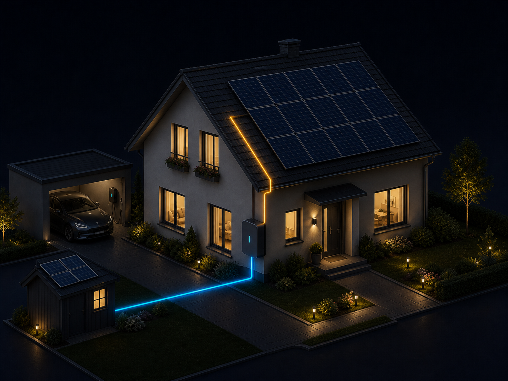

# HA Solar Dashboard Card (Polski)

Niestandardowa karta Lovelace dla Home Assistant w HACS, pokazująca nowoczesny podgląd energii/PV oparty na obrazie.

## Przykład

## Funkcje

- Tło graficzne (dom/projekt PV)
- Automatyczne przełączanie dzień/noc przez `sun.sun` (`*_day.png` w dzień)
- Nakładki z dowolnym pozycjonowaniem X/Y
- Wybieralne układy domów z folderu `images`
- Konfigurowalne encje (PV, bateria, falownik, wallbox, moc całkowita)
- Możliwość ukrywania pojedynczych pól

## Instalacja (HACS)

1. Dodaj to repozytorium do HACS jako **Custom repository** typu **Dashboard**.
2. Zainstaluj **HA Solar Dashboard Card**.
3. Uruchom ponownie Home Assistant (lub przeładuj zasoby).
4. Dodaj kartę w Lovelace.

> Pełne opcje konfiguracji znajdziesz w standardowej angielskiej README: [README.md](README.md)
